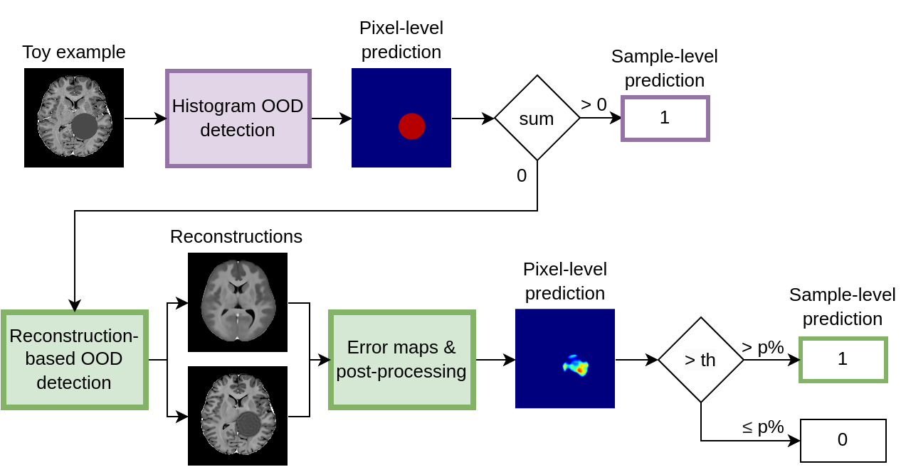

---

# Repository MOOD Challenge 2024 - team TUe_IMAGe 

This page contains the code to reproduce the submission of team TUe_IMAGe for the [MICCAI Medical Out-of-Distribution (MOOD) Challenge 2024](https://www.synapse.org/Synapse:syn21343101/wiki/599515).

This repository is based on [github.com/MIC-DKFZ/mood](https://github.com/MIC-DKFZ/mood), provided by the organizes of the challenge, and [github.com/evihuijben/mood_challenge](https://github.com/evihuijben/mood_challenge), our submission for MOOD2023.

Our MOOD2024 pipeline using histogram OOD detection method (purple) and reconstruction-based OOD detection method (green) is shown below. The same pipeline is used for brain MRI and abdominal CT data.




### Requirements


Install python requirements:

```
pip install -r docker_submission/scripts/generativeMRI/requirements.txt
```

To test the docker submission, you need to install [docker](https://www.docker.com/get-started) and [NVIDIA container Toolkit](https://github.com/NVIDIA/nvidia-docker).


The organizers suggest the following folder structure to work with the provided examples:

```
data/
--- brain/
------ brain_train/
------ toy/
------ toy_label/
--- abdom/
------ abdom_train/
------ toy/
------ toy_label/
```


## Training

#### Step 1: Prepare 2D datasets
Our model is trained on 2D data. To achieve fast training, we first preprocess the data to be saved as 2D axial slices. To prepare these dataset folders, follow these preprocessing steps:
* Split the datasets into a training and a validation set acoording to `docker_submission/scripts/generativeMRI/src/data/Data_split.csv`
* For the abdomen, downsample to 256x256x256.
* Normalize 3D volumes to the range [0, 1].
* Save all non-zero 2D axial slices (`.nii.gz`) to `<data_dir_train2D>` and `<data_dir_val2D>`.


#### Step 2: Prepare Weights & Biases
The training of the model is logged using Weights & Biases (W&B). To train the model, create a W&B project and use the `<wand_project>` and `<wandb_entity>` for running the code.


#### Step 3: Train the models
To train **Model8x8**, run the following command:

```
python docker_submission/scripts/generativeMRI/train_VAE_brain.py --vae_name Model8x8 --data_dir <data_dir_train2D> --data_dir_val <data_dir_val2D> --project <wandb_project> --wandb_entity <wandb_entity> 
```


To train **Model2x2**, run the following command:
```
layers2x2="--vae_attention_levels 0,0,0,0,0,0,0,1 --vae_num_chanels 128,128,256,256,512,512,512,512"
python docker_submission/scripts/generativeMRI/train_VAE_brain.py --vae_name Model2x2 $layers2x2 --data_dir <data_dir_train2D> --data_dir_val <data_dir_val2D> --project <wandb_project> --wandb_entity <wandb_entity> 
```


## Inference
#### Step 1: Add model checkpoints
Make sure to put the model checkpoints in the directory `docker_submission/scripts/inputs/checkpoints`:
```
docker_submission/scripts/inputs/checkpoints/
--- abdom_32x2x2/
------ checkpointG_best.pth
--- abdom_32x8x8/
------ checkpointG_best.pth
--- brain_32x2x2/
------ checkpointG_best.pth
--- brain_32x8x8/
------ checkpointG_best.pth
```

#### Step 2: Build Docker and test the model

Build and test the docker by running the following:

```
python docker_submission/run_example.py -i /data/brain
```

With `-i` you should pass the data input folder (which has to contain a _toy_ and _toy_label_ directory).

#### Step 3: Test the Docker for submission

To check whether the submission complies with the challenge format, run the following:

```
python scripts_mood_evaluate/test_docker.py -d mood_example -i /data/ -t sample
```
With `-i` you should pass the base data input folder (which has to contain a folder _brain_ and _abdom_, and both folders have to contain a _toy_ and _toy_label_ directory).

with `-t` you can define the Challenge Task (either _sample_ or _pixel_)

**Note**: The `test_docker.py` script was modified by removing the `--read-only` flag to allow downloading the model weights for calculating LPIPS. If the Docker container needs to run in a read-only environment, ensure that the downloaded AlexNet weights are saved as `docker_submission/scripts/inputs/lpips_model_weights/alexnet-owt-7be5be79.pth` and the LPIPS model weights as `docker_submission/scripts/inputs/lpips_model_weights/alex.pth`.


